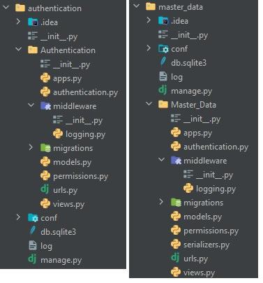

# Documentation

# Tools

I chose the web framework **Django** combined with Django **-Rest-Framework** since I&#39;ve been using them for the past year.

I used the **JSON Web Token** standard because I wanted the challenge of implementing the protocol by myself. I only previously used them in a library.

# Structure

There are 2 microservices. Each one is its own Django project with just one app named after the project itself. The folder structure looks like this:

Project files:

- \_\_init\_\_.py: empty file that makes the folder a python package
- conf: folder where Django configuration files reside. It remains mostly untouched, except for adding my custom middleware.
- log: log of all the requests and responses for each microservice.
- py: Django CLI endpoint to run commands, not touched.
- sqlite3: simple database used by the master\_data service. Unused by auth service

App files (just one app on each service):

- py: configures the app to be recognized by other apps, untouched by me.
- authentication: custom authentication classes that attach a user object to the request object. In the authentication microservice, this is where the main JWT protocol resides. In the master\_data microservice, this makes an API call to the auth service.
- middleware: folder where my middleware resides. It&#39;s the same file on both services. It logs requests and responses to a file called log
- migrations: database migrations managed by Django. Untouched by me. (Although the user should run &quot;python manage.py makemigrations \<APP_NAME\>&quot; followed by &quot;python manage.py migrate&quot; to create the database tables before running the master data service for the first time.
- models: where the database models reside for the master data service, and where the custom user class resides for the auth service.
- permissions: custom permissions to attach to each view. This will dictate whether a given user has access to an endpoint or not. The file in auth service contains permissions for all the roles but are not used atm.
- serializers: only on master data service. It&#39;s a DRF class for serializing data from the database and deserializing it from the HTTP requests. It remains mostly boilerplate.
- urls: where the endpoints of the API are declared.
- views: the views are attached to each endpoint and are the first step when receiving a request. They make most of the heavy lifting and this is where a lot of my code resides.

# API Specification

## Authentication Service

**/users**

auth: &quot;Bearer {JWT}&quot;. Should be included in the auth header.
 permissions: only users with administrator roles will be allowed

GET: retrieve a list of users
 body: {}

POST: create a new user
 body: {username: string, password: string, role: string in [&quot;ADMINISTRATOR&quot;, &quot;SECRETARY&quot;, &quot;MANAGER&quot;]

DELETE: delete a user
 body: {username: string}

**/token**

auth: None
 permissions: None

GET: receive a token from a valid username and password
 body: {username: string, password: string}

POST: get user data from token
 body: {token: string}

## Master Data Service

**/jobs**

auth: &quot;Bearer {JWT}&quot;. Should be included in the auth header.
 permissions: only users with administrator or manager roles will be allowed

GET: retrieve a list of jobs
 body: {}

POST: create a new job
 body: {status: int in [1,2,3], date_dange: date, assets: string (but composed of comma separated ints)}

**/jobs/\<int\>;**

GET: retrieve a single job
 body: {}

DELETE: delete a job
 body: { }

PATCH: update a job
 body: any field mentioned before

**/results**

auth: &quot;Bearer {JWT}&quot;. Should be included in the auth header.
 permissions: only users with administrator or manager roles will be allowed

GET: retrieve a list of jobs
 body: {}

POST: create a new job
 body: {job: URL of a job, assets: string (but composed of comma separated ints),weights: string (but composed of comma separated ints)}}

**/results/\<int\>;**

GET: retrieve a single job
 body: {}

DELETE: delete a job
 body: {}

PATCH: update a job
 body: any field mentioned before

# How to run the 2 microservices
activate virtualenv and install the packages on requirements.txt:
- pip install -r requirements.txt

on one terminal go to the authentication folder, and run the django server on port 8000:
- python manage.py runserver 8000

on the other terminal go to the master data service folder and run the django server on port 9000:
- python manage.py makemigrations Master_data
- python manage.py migrate
- python manage.py runserver 9000